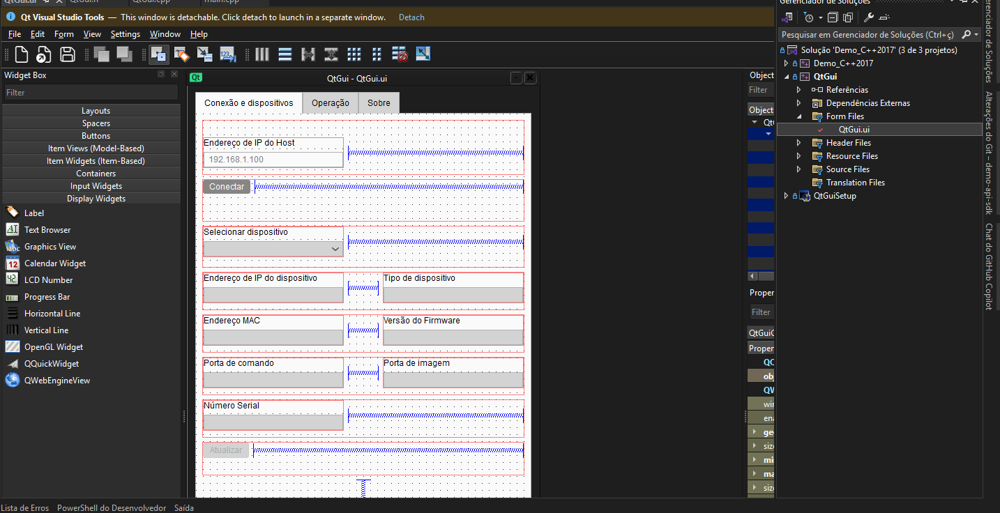
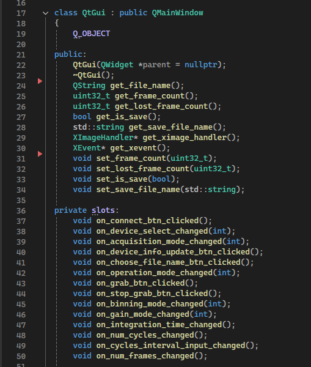
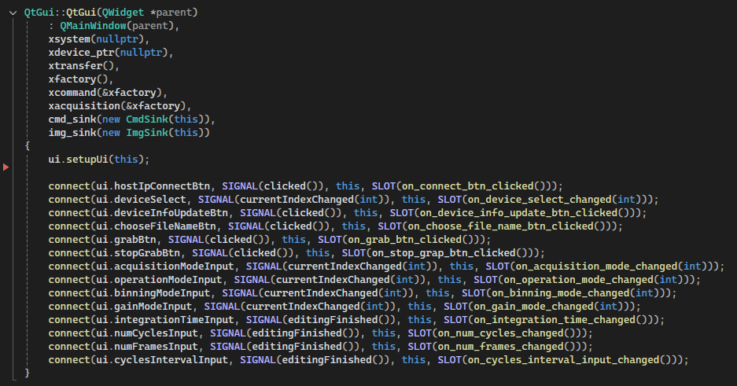
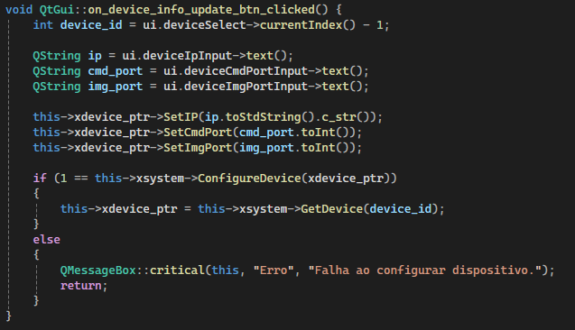

# Software para Manipulação do Detector X-Panel 1412i

[](https://isocpp.org/)
[](https://www.qt.io/)
[](https://visualstudio.microsoft.com/)

Software completo para interação e controle do detector de raios-X X-Panel 1412i, desenvolvido em C++. Este projeto oferece:

- 🖼️ **Captura de imagens** em tempo real do detector
- ⚙️ **Controle avançado** de parâmetros do dispositivo (ganho, binning, tempo de integração)
- 🖥️ **Interface gráfica intuitiva** desenvolvida com Qt
- 🔌 **API robusta** para comunicação via UDP/Ethernet
- 📊 **Suporte a tomografia** com múltiplos ciclos de captura
- 💾 **Exportação** de imagens em formato .dat e .txt

O projeto é composto por dois módulos principais:

1. **Demo (Console)**: Aplicação de linha de comando para testes e operações automatizadas
2. **QtGui**: Interface gráfica completa para operação interativa do detector

## Tabela de Conteúdos

- [Requisitos](#requisitos)
- [Instalação](#instalação)
  - [MinGW](#mingw-compiler)
  - [Visual Studio](#visual-studio)
  - [Qt](#qt)
  - [API do detector](#api-do-detector)
- [Como Rodar](#como-rodar)
- [Documentação API](#documentação-api)
  - [Manipular eventos](#manipular-eventos)
    - [Eventos de comando](#eventos-de-comando)
    - [Eventos de imagem](#eventos-de-imagem)
  - [Manipular componentes](#manipular-componentes)
    - [Sistema](#sistema)
      - [Registrar eventos](#registrar-eventos)
      - [Detectar dispositivos](#detectar-dispositivos)
      - [Obter um dispositivo](#obter-um-dispositivo-conectado)
      - [Realizar operações em um dispositivo](#realizar-operações-em-um-dispositivo)
    - [Comando](#comando)
      - [Instanciar e registrar eventos de comando](#instanciar-e-registrar-eventos-de-comandos)
      - [Enviar comandos ASCII](#enviar-comandos-ascii)
      - [Definir parâmetros do dispositivo](#definir-darâmetros-do-dispositivo)
      - [Obter parâmetros do dispositivo](#obter-parâmetros-do-dispositivo)
      - [Parâmetros](#parâmetros)
    - [Aquisição e transferência de imagens](#aquisição-e-transferência)
      - [Instanciar e registrar eventos](#instanciar-e-registrar-eventos-de-aquisição-e-transferência)
      - [Abrir e fechar canal de imagem](#abrir-e-fechar-canal-de-imagem)
      - [Capturar imagens](#capturar-imagens)
- [Documentação Interface gráfica](#documentação-interface-gráfica)
  - [Personalizar a interface gráfica](#personalizar-a-interface-gráfica)
  - [Manipulação de eventos da interface gráfica](#manipulação-de-eventos-da-interface-gráfica)
  - [Slots do projeto](#slots-do-projeto)
    - [on_connect_btn_clicked](#slot-1---on_connect_btn_clicked)
    - [on_device_select_changed](#slot-2---on_device_select_changed)
    - [on_device_info_update_btn_clicked](#slot-3---on_device_info_update_btn_clicked)
    - [on_choose_file_name_btn_clicked](#slot-4---on_choose_file_name_btn_clicked)
    - [on_acquisition_mode_changed](#slot-5---on_acquisition_mode_changed)
    - [on_operation_mode_changed (Não implementado](#slot-6---on_operation_mode_changed-não-implementado)
    - [on_binning_mode_changed](#slot-7---on_binning_mode_changed)
    - [on_gain_mode_changed](#slot-8---on_gain_mode_changed)
    - [on_integration_time_changed](#slot-9---on_integration_time_changed)
    - [on_num_cycles_changed](#slot-10---on_num_cycles_changed)
    - [on_num_frames_changed](#slot-11---on_num_frames_changed)
    - [on_cycles_interval_input_changed](#slot-12---on_cycles_interval_input_changed)
    - [on_grab_btn_clicked](#slot-13---on_grab_btn_clicked)
    - [on_stop_grab_btn_clicked](#slot-14---on_stop_grab_btn_clicked)

## Requisitos

### Software Necessário

| Componente | Versão Mínima | Propósito |
|-----------|---------------|-----------|
| **MinGW Compiler** | 8.1.0 ou superior | Compilação do código C++ |
| **Visual Studio** | 2019 ou posterior | IDE de desenvolvimento principal |
| **MSYS2** | Última versão | Gerenciamento de pacotes no Windows |
| **Qt Framework** | 5.x ou superior | Interface gráfica (apenas para QtGui) |
| **Qt Visual Studio Tools** | Compatível com VS 2019 | Integração Qt/Visual Studio |

### Hardware Necessário

- **Detector X-Panel 1412i** da Varex Imaging
- **Conexão Ethernet Gigabit** para comunicação com o detector
- **Windows 10/11** (64-bit recomendado para melhor performance)
- **8GB RAM** mínimo (16GB recomendado para processamento de imagens)

### Conhecimentos Recomendados

- Fundamentos de C++ (classes, ponteiros, herança)
- Programação orientada a eventos
- Conceitos básicos de redes (UDP/TCP, endereçamento IP)
- Qt framework (apenas para desenvolvimento da interface gráfica)

## Instalação

### MinGW Compiler

O MinGW é necessário para compilar o código C++ no ambiente Windows.

1. **Baixe o MSYS2:**

   Acesse [MSYS2.org](https://www.msys2.org/) e baixe o instalador para Windows.

2. **Instale o MinGW via MSYS2:**

   Após instalar o MSYS2, abra o terminal MSYS2 e execute:

    ```bash
    # Atualizar base de dados de pacotes
    pacman -Syu

    # Instalar o compilador MinGW para arquitetura x86_64
    pacman -S mingw-w64-ucrt-x86_64-gcc
    ```

3. **Configure as variáveis de ambiente:**

   Adicione o caminho do MinGW ao PATH do sistema:
   - Abra "Variáveis de Ambiente" no Windows
   - Adicione `C:\msys64\ucrt64\bin` à variável PATH
   - Reinicie o terminal para aplicar as mudanças

4. **Verifique a instalação:**

    ```bash
    gcc --version
    g++ --version
    ```

### Visual Studio

O Visual Studio é a IDE principal recomendada para este projeto.

1. **Download:**

   Acesse [Visual Studio](https://visualstudio.microsoft.com/pt-br/) e baixe a versão Community (gratuita) ou superior.

2. **Instalação:**

   Durante a instalação, selecione as seguintes cargas de trabalho:
   - ✅ **Desenvolvimento para desktop com C++**
   - ✅ **Ferramentas de desenvolvimento do C++ para Windows**

   Componentes individuais recomendados:
   - SDK do Windows 10/11
   - Compilador MSVC v142 ou superior
   - CMake para Windows

3. **Configuração pós-instalação:**

   - Abra o Visual Studio
   - Configure o tema e preferências
   - Instale a extensão "Qt Visual Studio Tools" (ver seção Qt)

### Qt Framework

O Qt é necessário apenas se você pretende trabalhar com a interface gráfica (projeto QtGui).

1. **Download:**

   Acesse [Qt.io](https://www.qt.io/download-dev) e baixe o instalador online.

2. **Instalação:**

   Durante a instalação:
   - Crie uma conta Qt (gratuita para open source)
   - Selecione a versão Qt 5.15.x ou Qt 6.x
   - Marque os seguintes componentes:
     - Qt 5.15.x/6.x Desktop MinGW
     - Qt 5.15.x/6.x MSVC 2019 64-bit
     - Qt Creator (opcional, mas recomendado)

3. **Extensão Visual Studio Tools:**

   No Visual Studio:
   - Vá em `Extensions` → `Manage Extensions`
   - Busque por "Qt Visual Studio Tools"
   - Instale e reinicie o Visual Studio
   - Configure: `Extensions` → `Qt VS Tools` → `Qt Options`
   - Adicione a versão do Qt instalada (ex: `C:\Qt\5.15.2\msvc2019_64`)

### API do Detector (X-LIB)

A API X-LIB está incluída no projeto na pasta `lib/` e `include/`. Para configurar o ambiente:

### API do Detector (X-LIB)

A API X-LIB está incluída no projeto na pasta `lib/` e `include/`. Para configurar o ambiente:

1. **Abra a solução no Visual Studio:**

   Abra o arquivo `Demo_C++2017.sln` no Visual Studio.

2. **Configure o projeto QtGui** (ou Demo_C++2017 conforme necessário):

   Clique com o botão direito no projeto → `Propriedades`

3. **Configure os diretórios de saída:**

   - Navegue: `Propriedades de Configuração` → `Geral`
   - **Diretório de saída:** `bin\$(Platform)\$(Configuration)\`
   - **Diretório intermediário:** `bin\$(Platform)\$(Configuration)\`

4. **Configure os diretórios de inclusão:**

   - Navegue: `C/C++` → `Geral`
   - **Diretórios de inclusão adicionais:**

     ```
     %(AdditionalIncludeDirectories);$(ProjectDir);$(Qt_INCLUDEPATH_);../include/
     ```

5. **Configure os diretórios de bibliotecas:**

   - Navegue: `Linker` → `Geral`
   - **Diretórios de biblioteca adicionais:** `../lib/x64` (ou `../lib/x86` para 32-bit)

6. **Configure as dependências:**

   - Navegue: `Linker` → `Entrada`
   - **Dependências adicionais:**

     ```
     $(CoreLibraryDependencies);%(AdditionalDependencies);$(Qt_LIBS_);
     kernel32.lib;user32.lib;gdi32.lib;winspool.lib;comdlg32.lib;
     advapi32.lib;shell32.lib;ole32.lib;oleaut32.lib;uuid.lib;
     odbc32.lib;odbccp32.lib;XLibDllKosti.lib
     ```

7. **Configure cabeçalhos pré-compilados:**

   Para `main.cpp` (ou outros arquivos .cpp):
   - Clique com botão direito → `Propriedades`
   - `C/C++` → `Cabeçalhos Pré-compilados`
   - Selecione: **Usar (/Yu)**
   - **Arquivo de cabeçalho pré-compilado:** `stdafx.h`

   Para `stdafx.cpp`:
   - Mesmas etapas acima
   - Selecione: **Criar (/Yc)**

8. **Aplique e compile:**

   - Clique em `Aplicar` → `OK`
   - Compile o projeto: `Build` → `Build Solution` (F7)

> **Nota:** A biblioteca X-LIB (`XLibDllKosti.lib`) já está incluída no projeto na pasta `lib/`. Certifique-se de que está usando a versão correta (x64 ou x86) conforme sua configuração.

## Como Rodar

### Compilando o Projeto

1. **Abra a solução:**

   ```
   Demo_C++2017.sln
   ```

2. **Selecione a configuração:**
   - **Platform:** x64 (recomendado) ou x86
   - **Configuration:** Release (para produção) ou Debug (para desenvolvimento)

3. **Compile:**
   - Pressione `F7` ou vá em `Build` → `Build Solution`
   - Aguarde a compilação finalizar sem erros

### Executando o QtGui (Interface Gráfica)

1. **Localize o executável:**

   ```
   x64/Release/QtGui.exe
   ```

2. **Execute o programa:**
   - Duplo clique no executável, ou
   - Execute diretamente do Visual Studio (F5 para Debug, Ctrl+F5 para Release)

3. **Conecte ao detector:**
   - Insira o IP do host (ex: `192.168.0.1`)
   - Clique em "Conectar"
   - Selecione o dispositivo detector encontrado

4. **Configure os parâmetros:**
   - Modo de aquisição (Radiografia/Tomografia)
   - Tempo de integração
   - Ganho (Alto/Baixo)
   - Binning (Normal/2x2)

5. **Capture imagens:**
   - Selecione um arquivo de destino (.dat)
   - Clique em "Iniciar captura"

### Executando o Demo (Console)

1. **Localize o executável:**

   ```
   x64/Release/Demo.exe
   ```

2. **Execute via terminal:**

   ```bash
   cd x64/Release
   Demo.exe 192.168.0.1
   ```

   Onde `192.168.0.1` é o IP do host.

3. **Ou execute sem argumentos:**

   ```bash
   Demo.exe
   ```

   O programa solicitará o IP do host interativamente.

4. **Use o menu interativo:**

   ```
   1- Encontrar dispositivo
   2- Configurar dispositivo
   3- Abrir dispositivo
   4- Enviar comando ASCII
   5- Capturar
   6- Parar
   7- Capturar e salvar
   ...
   q- Sair do programa
   ```

### Configuração de Rede

Certifique-se de que:

- O computador e o detector estão na mesma sub-rede
- O firewall permite comunicação UDP nas portas 3000 (comando) e 4001 (imagem)
- O detector está ligado e configurado corretamente

**Exemplo de configuração de rede:**

- **Host IP:** 192.168.0.1
- **Detector IP:** 192.168.0.2
- **Porta de comando:** 3000
- **Porta de imagem:** 4001

## Documentação API

### Manipular eventos

#### Eventos de comando

A API oferece a interface `IXCmdSink` para manipulação de eventos de comando do dispositivo. No exemplo abaixo, é apresentada uma implementação dessa interface:

```c++
//A class for handling command events
  class CmdSink :public IXCmdSink
  {
  public:
    // Manipulação de erro
    // Parâmetros err_id: ID do error, err_msg_: Mensagem de erro
    void OnXError(uint32_t err_id, const char* err_msg_) override
    {
      cout << "OnXError: " << err_id << ", " << err_msg_ << endl;
    }
    // Manipulação de eventos
    // Parâmetros event_id: ID do evento, data: Dados do evento
    // Eventos: _cisTemperature; _dasTemperature1; _dasTemperature2; _dasTemperature3; _dasHumidity;
    void OnXEvent(uint32_t event_id, XHealthPara data) override
    {
      // cout << "On Event ID " << event_id << " data " << data._dasTemperature1 << endl;
    }
  };
```

#### Eventos de imagem

A API oferece a interface `IXImgSink` para manipulação de eventos de imagem. No exemplo abaixo, é apresentada uma implementação dessa interface:

```c++
  class ImgSink : public IXImgSink
  {
    // Manipulação de erro
    // Parâmetros err_id: ID do error, err_msg_: Mensagem de erro
    void OnXError(uint32_t err_id, const char* err_msg_) override
    {
      printf("OnXERROR: %u, %s\n", err_id, err_msg_);
    }

    // Manipulação de eventos
    // Parâmetros event_id: ID do evento, data: Dados do evento
    // Eventos: XEVENT_IMG_PARSE_DATA_LOST, XEVENT_IMG_TRANSFER_BUF_FULL, XEVENT_IMG_PARSE_DM_DROP,
    //          XEVENT_IMG_PARSE_PAC_LOST, XEVENT_IMG_PARSE_MONITOR_STATUS_ERR
    void OnXEvent(uint32_t event_id, uint32_t data) override
    {
      if (XEVENT_IMG_PARSE_DATA_LOST == event_id)
      {
        lost_frame_count += data;
      }
    }

    // Manipulação de quadros prontos
    // Parâmetros image_: Ponteiro para o quadro
    void OnFrameReady(XImage* image_) override
    {
      printf("Frame %u ready, width %u, height %d,  lost line %u\n",
        frame_count++, image_->_width, image_->_height, lost_frame_count);

      if (is_save)
      {
        ximg_handle.Write(image_);
      }
    }

    // Manipulação de quadros completos
    void OnFrameComplete() override
    {
      printf("Grab complete.\n");

      if (is_save)
      {
        string txt_name = save_file_name.replace(save_file_name.find(".dat"), 4, ".txt");

        ximg_handle.SaveHeaderFile(txt_name.c_str());
        ximg_handle.CloseFile();

        is_save = 0;
      }

      frame_complete.Set();
    }
  };
```

### Manipular componentes

#### Sistema

A API oferece a classe `XSystem` para facilitar a comunicação entre o computador host e os dispositivos conectados. Para instanciar um objeto `XSystem`, é necessário fornecer o endereço IP do host no construtor. O exemplo abaixo demonstra como utilizar essa classe para estabelecer a conexão:

```c++
  XSystem xsystem("192.168.0.1");

  if (!xsystem.Open()) // Verifica se a conexão com o host foi estabelecida com sucesso
  {
      std::cerr << "Falha ao conectar ao host." << std::endl;
      return 0;  // Termina a execução se não conseguir conectar
  }
```

##### Registrar eventos

Para permitir que o sistema escute eventos gerados por dispositivos conectados, você precisa registrar um "event sink", como mostrado abaixo:

```c++
  CmdSink cmd_sink;
  xsystem.RegisterEventSink(&cmd_sink);
```

##### Detectar dispositivos

Para detectar a quantidade de dispositivos conectados ao sistema, você pode usar o método `FindDevices` da classe `XSystem`:

```c++
  xsystem.FindDevices();

  if (device_count <= 0)
  {
    printf("No device found.\n ");
    return 0;
  }
```

##### Obter um dispositivo conectado

Após detectar os dispositivos, você pode obter uma referência a um dispositivo conectado utilizando o método `GetDevice`:

```c++
  XDevice* xdevice_ptr = NULL;
  uint32_t device_id = 0;

  //Pega o primeiro dispositivo
  xdevice_ptr = xsystem.GetDevice(device_id);
```

##### Realizar operações em um dispositivo

A API oferece a classe `XDevice` para realizar operações em um dispositivo. Um dispositivo pode ser obtido com a função `GetDevice` da classe `XSystem`. A classe XDevice oferece métodos para acessar e configurar parâmetros do dispositivo, conforme mostrado no exemplo abaixo:

```c++
  XSystem xsystem("192.168.0.1");
  XDevice* xdevice_ptr = NULL;
  uint32_t device_id = 0;

  // Obtém o primeiro dispositivo conectado
  xdevice_ptr = xsystem.GetDevice(device_id);

  // Verifica se o dispositivo foi encontrado
  if (xdevice_ptr != NULL)
  {
      // Pega parâmetros do dispositivo
      cout << "Dispositivo encontrado: " << xdevice_ptr->GetIP() << endl;   // IP do dispositivo
      cout << "Porta de comando: " << xdevice_ptr->GetCmdPort() << endl;    // Porta de comando
      cout << "Porta de imagem: " << xdevice_ptr->GetImgPort() << endl;     // Porta de imagem

      // Define novos parâmetros do dispositivo
      xdevice_ptr->SetIP("192.168.0.100"); // Altera o IP do dispositivo
      xdevice_ptr->SetCmdPort(3000);       // Altera a porta de comando
      xdevice_ptr->SetImgPort(5000);       // Altera a porta de imagem

      // Atualiza as configurações do dispositivo
      xsystem.ConfigureDevice(xdevice_ptr);

      // Atualiza o ponteiro do dispositivo após configuração
      xdevice_ptr = xsystem.GetDevice(device_id);
  }
  else
  {
      cout << "Nenhum dispositivo encontrado com o ID fornecido." << endl;
  }
```

#### Comando

A classe XCommand é responsável por enviar comandos e parâmetros ao dispositivo conectado, assim como configurar o seu funcionamento. Abaixo está uma explicação detalhada sobre o uso de XCommand e os parâmetros que podem ser enviados.

##### Instanciar e registrar eventos de comandos

```c++
  XGigFactory xfactory;
  XCommand xcommand(&xfactory);

  // Registrar o gerenciador de eventos de comando
  xcommand.RegisterEventSink(&cmd_sink);

  // Abrir comunicação com o dispositivo
  xcommand.Open(xdevice_ptr);

  // Fechar comunicação com o dispositivo
  xcommand.Close();


```

##### Enviar comandos ASCII

```c++
  xcommand.SendAscCmd(send_str, recv_str);
  cout << "Resposta: " << recv_str << endl;

```

##### Definir darâmetros do dispositivo

```c++
  uint64_t cmd_para = 0;

  if (1 == xcommand.SetPara(XPARA_BINNING_MODE, cmd_para)) {
    cout << "Modo de binning definido com sucesso\n\n";
  }
```

##### Obter parâmetros do dispositivo

```c++
  uint64_t operation_mode;
  uint32_t device_id = 0;
  xcommand.GetPara(XPARA_OPE_MODE, operation_mode, device_id);
```

##### Parâmetros

Abaixo estão os parâmetros que podem ser utilizados com os métodos `SetPara` e `GetPara`:

- XPARA_INIT_PARA
- XPARA_SAVE_PARA
- XPARA_FRAME_PERIOD
- XPARA_NON_INTTIME
- XPARA_OPE_MODE
- XPARA_GAIN_RANGE
- XPARA_EN_SCAN
- XPARA_BINNING_MODE
- XPARA_OUTPUT_RESOLUTION
- XPARA_INPUT_TRIGGER_MODE
- XPARA_EN_INPUT_TRIGGER
- XPARA_OUTPUT_TRIGGER_MODE
- XPARA_EN_OUTPUT_TRIGGER
- XPARA_PIXEL_NUMBER
- XPARA_MAXMIN_FRAME_PERIOD
- XPARA_DAS_FIRM_VER
- XPARA_DAS_TEST_MODE
- XPARA_DAS_SERIAL
- XPARA_INIT1_PARA
- XPARA_EN_LED
- XPARA_DAS_HEALTH
- XPARA_CONFIG_FIRMWARE
- XPARA_EN_ROI
- XPARA_ROI
- XPARA_READ_OUT_PERIOD
- XPARA_READ_OUT_TIME
- XPARA_GCU_WORK_TIME
- XPARA_DEVICE_TYPE

#### Aquisição e transferência

A API fornece duas classes para gerenciar o processo de aquisição de imagens e a transferência de dados do dispositivo para o host, respectivamente. As classes envolvidas nesse processo são XFrameTransfer e XAcquisition.

##### Instanciar e registrar eventos de aquisição e transferência

```c++
  XGigFactory xfactory;
  XFrameTransfer xtransfer;
  XImgSink img_sink;

  // Registrar o manipulador de eventos de imagem (img_sink)
  xtransfer.RegisterEventSink(&img_sink);

  // Criar o objeto para gerenciar o processo de aquisição de imagens
  XAcquisition xacquisition(&xfactory);

  // Registrar o manipulador de eventos
  xacquisition.RegisterEventSink(&img_sink);

  // Registrar o manipulador de transferência
  xacquisition.RegisterFrameTransfer(&xtransfer);
```

##### Abrir e fechar canal de imagem

```c++
  // Abrir canal de imagem
  if (xacquisition.Open(xdevice_ptr, &xcommand))
  {
      cout << "Canal de imagem aberto com sucesso" << endl;
  }
  else
  {
      cout << "Falha ao abrir o canal de imagem" << endl;
  }

  // Fechar canal de imagem
  xacquisition.Close();
```

##### Capturar imagens

```c++
  // Quantidade de frames a serem capturados.
  // Passar um valor 0 faz a captura acontecer de forma contínua.
  int num_frames = 0;

  // Iniciar captura de frames de forma continua
  xacquisition.Grab(num_frames);

  // Parar captura de frames
  xacquisition.Stop();

  // Nova quantidade de frames
  num_frames = 15;

  // Iniciar captura de 15 frames
  xacquisition.Grab(num_frames);
```

## Documentação interface gráfica

### Personalizar a interface gráfica

Com a extensão ``Visual Studio Tools`` instalada, acesse o arquivo ``QtGui.ui`` na pasta lógica ``Form Files``, localizada dentro da solução no ``Visual Studio 2019``.

 

Na aba aberta do QtGui.ui, é possível personalizar elementos da interface arrastando e soltando componentes. Além disso, há a opção de incluir código CSS para estilização.

### Manipulação de eventos da interface gráfica

A manipulação de eventos que ocorrem na interface pode ser feita por meio de slots na classe ``QtGui``. A classe ``QtGui`` está dividida em dois arquivos: ``QtGui.h`` e ``QtGui.cpp``. O arquivo ``QtGui.h`` contém o cabeçalho da classe, enquanto o arquivo ``QtGui.cpp`` possui a definição da classe.

Para adicionar um slot, primeiro adicione o cabeçalho da função que manipulará o evento no cabeçalho da classe ``QtGui``, localizado no arquivo ``QtGui.h``.



Em seguida, vincule a função com o evento da interface no construtor da classe ``QtGui`` no arquivo ``QtGui.cpp``.



Por fim, implemente a função para manipular o evento da interface como um método da classe ``QtGui``.



### Slots do projeto

Esse projeto contém 14 slots. A seguir são descritos cada um deles.

#### Slot 1 - on_connect_btn_clicked

O slot 1 é responsável por manipular o evento de clique do botão Conectar na tela de Conexão e dispositivos. Ao clicar no botão Conectar, esse slot verifica se o endereço IP do host informado é válido, realiza a configuração inicial com a API do detector e executa uma busca por dispositivos detectores na rede.

#### Slot 2 - on_device_select_changed

O slot 2 é responsável por manipular o evento de mudança de índice na caixa de seleção Selecionar dispositivo na tela de Conexão e Dispositivos. Ao selecionar um novo dispositivo, esse slot deleta a referência ao dispositivo anterior, busca o novo dispositivo e suas informações, e preenche os campos correspondentes na tela de Conexão e Dispositivos.

#### Slot 3 - on_device_info_update_btn_clicked

O slot 3 é responsável por manipular o evento de clique do botão Atualizar na tela de Conexão e dispositivos. Ao clicar no botão Atualizar, esse slot atualiza os campos com as informações mais recentes e envia esses dados atualizados para o detector.

#### Slot 4 - on_choose_file_name_btn_clicked

O slot 4 é responsável por manipular o evento de clique do botão Selecionar nome do arquivo na tela de Operação. Ao clicar no botão, o slot abre uma janela para que o usuário selecione um arquivo com extensão .dat.

#### Slot 5 - on_acquisition_mode_changed

O slot 5 manipula a mudança de índice na caixa de seleção Modo de aquisição na tela de Operação. Quando um novo modo de aquisição é selecionado, o slot ajusta a interface ativando ou desativando campos conforme o modo escolhido. Por exemplo, campos como número de ciclos e intervalo entre ciclos podem ser habilitados no modo de tomografia e desabilitados no modo de radiografia.

#### Slot 6 - on_operation_mode_changed (Não implementado)

O slot 6 manipula a mudança de índice na caixa de seleção Modo de operação na tela de Operação. Esse slot não foi implementado devido a falta de documentação da API do detector para essa operação.

#### Slot 7 - on_binning_mode_changed

O slot 7 manipula a mudança de índice na caixa de seleção Modo de binning na tela de Operação. Quando um novo modo de binning é selecionado, esse slot envia um comando diretamente ao detector, instruindo-o a alterar o modo de binning para o valor escolhido.

#### Slot 8 - on_gain_mode_changed

O slot 8 manipula a mudança de índice na caixa de seleção Modo de ganho na tela de Operação. Quando um novo modo de ganho é selecionado, esse slot envia um comando diretamente ao detector, instruindo-o a alterar o modo de ganho para o valor escolhido.

#### Slot 9 - on_integration_time_changed

O slot 9 manipula o evento de finalização de edição no campo de texto Tempo de integração na tela de Operação. Quando um novo valor é digitado e confirmado, o slot envia um comando diretamente ao detector, instruindo-o a ajustar o tempo de integração para o valor inserido.

Além disso, o slot executa uma validação para garantir que o valor não seja negativo, evitando assim falhas na operação do detector. Caso um valor inválido seja detectado, o sistema pode alertar o usuário ou reverter o campo para o último valor válido.

#### Slot 10 - on_num_cycles_changed

O slot 10 manipula o evento de finalização de edição no campo de texto Número de ciclos na tela de Operação. Quando um novo valor é digitado e confirmado, o slot envia um comando diretamente ao detector, instruindo-o a ajustar o número de ciclos para o valor inserido.

Além disso, o slot executa uma validação para garantir que o valor não seja negativo, evitando assim falhas na operação do detector. Caso um valor inválido seja detectado, o sistema pode alertar o usuário ou reverter o campo para o último valor válido.

#### Slot 11 - on_num_frames_changed

O slot 11 manipula o evento de finalização de edição no campo de texto Número de frames na tela de Operação. Quando um novo valor é digitado e confirmado, o slot envia um comando diretamente ao detector, instruindo-o a ajustar o número de frames para o valor inserido.

Além disso, o slot executa uma validação para garantir que o valor não seja negativo, evitando assim falhas na operação do detector. Caso um valor inválido seja detectado, o sistema pode alertar o usuário ou reverter o campo para o último valor válido.

#### Slot 12 - on_cycles_interval_input_changed

O slot 12 manipula o evento de finalização de edição no campo de texto Intervalo entre ciclos na tela de Operação. Quando um novo valor é digitado e confirmado, o slot envia um comando diretamente ao detector, instruindo-o a ajustar o intervalo entre ciclos para o valor inserido.

Além disso, o slot executa uma validação para garantir que o valor não seja negativo, evitando assim falhas na operação do detector. Caso um valor inválido seja detectado, o sistema pode alertar o usuário ou reverter o campo para o último valor válido.

#### Slot 13 - on_grab_btn_clicked

O slot 13 é responsável por manipular o evento de clique do botão Iniciar captura na tela de Operação. Ao clicar no botão, o slot envia um comando diretamente ao detector para iniciar aquisição de imagens.

#### Slot 14 - on_stop_grab_btn_clicked

O slot 13 é responsável por manipular o evento de clique do botão Parar captura na tela de Operação. Ao clicar no botão, o slot envia um comando diretamente ao detector para parar a aquisição de imagens.
